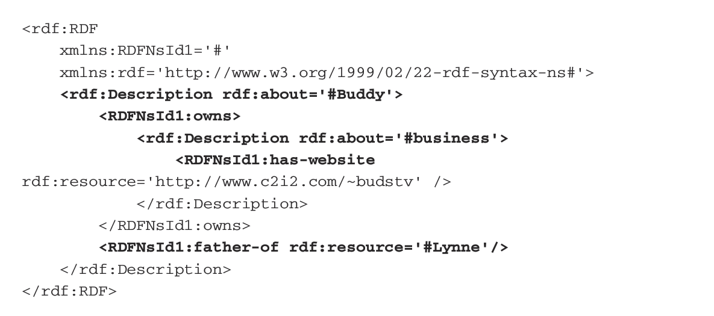

<h1>RIPS 2018 Readings</h1>

## Table of Contents
* Machine Learning
  * General
  * Naive Bayes
  * Recurrent Neural Networks
  * Long-Short Term Memory Recurrent Neural Networks
* Natural Language Processing
  * General
  * Information Extraction
  * word2vec and doc2vec
* Semantic Web
  * General
  * Knowledge Graphs
  * Computational Fact-Checking
* Statistical Relational Learning
  * General
  * Managing Relational Data
    * Resource Description Framework
    * SPARQL Protocol and RDF Query Language

<h2>Machine Learning</h2>

Machine learning is a subset of artificial intelligence in the field of computer science that often uses statistical techniques to give computers the ability to "learn" (i.e., progressively improve performance on a specific task) with data, without being explicitly programmed.

#### General

##### Articles, Blogposts, and Tutorials

* [Awesome Machine Learning](https://github.com/josephmisiti/awesome-machine-learning#python-nlp)
* [A Neural Network in 11 lines of Python (Part 1)](https://iamtrask.github.io/2015/07/12/basic-python-network/)
* [A Neural Network in 13 lines of Python (Part 2 - Gradient Descent)](http://iamtrask.github.io/2015/07/27/python-network-part2/)

#### Naive Bayes

Naive Bayes is a simple technique for constructing classifiers: models that assign class labels to problem instances, represented as vectors of feature values, where the class labels are drawn from some finite set.

##### Articles, Blogposts, and Tutorials

* [6 Easy Steps To Learn Naive Bayes Algorithm](https://www.analyticsvidhya.com/blog/2017/09/naive-bayes-explained/)
* [Wikipedia Page](https://en.wikipedia.org/wiki/Naive_Bayes_classifier)

#### Recurrent Neural Networks

A recurrent neural network (RNN) is a class of artificial neural network where connections between nodes form a directed graph along a sequence. This allows it to exhibit dynamic temporal behavior for a time sequence. Unlike feedforward neural networks, RNNs can use their internal state (memory) to process sequences of inputs. This makes them applicable to tasks such as unsegmented, connected handwriting recognition or speech recognition.

##### Articles, Blogposts, and Tutorials

* [Recurrent Neural Networks Tutorial, Part 1 – Introduction to RNNs](http://www.wildml.com/2015/09/recurrent-neural-networks-tutorial-part-1-introduction-to-rnns/)
* [Recurrent Neural Networks Tutorial, Part 2 – Implementing a RNN with Python, Numpy and Theano](http://www.wildml.com/2015/09/recurrent-neural-networks-tutorial-part-2-implementing-a-language-model-rnn-with-python-numpy-and-theano/)
* [Recurrent Neural Networks Tutorial, Part 3 – Backpropagation Through Time and Vanishing Gradients](http://www.wildml.com/2015/10/recurrent-neural-networks-tutorial-part-3-backpropagation-through-time-and-vanishing-gradients/)
* [Recurrent Neural Networks Tutorial, Part 4 – Implementing a GRU/LSTM RNN with Python and Theano](http://www.wildml.com/2015/10/recurrent-neural-network-tutorial-part-4-implementing-a-grulstm-rnn-with-python-and-theano/)
* [The Unreasonable Effectiveness of Recurrent Neural Networks](http://karpathy.github.io/2015/05/21/rnn-effectiveness/)
* [Wikipedia Page](https://en.wikipedia.org/wiki/Recurrent_neural_network)

#### Long-Storm Term Memory Recurrent Neural Networks

Long short-term memory (LSTM) units (or blocks) are a building unit for layers of a recurrent neural network (RNN). A common LSTM unit is composed of a cell, an input gate, an output gate and a forget gate. The cell is responsible for "remembering" values over arbitrary time intervals; hence the word "memory" in LSTM. Each of the three gates can be thought of as a "conventional" artificial neuron, as in a multi-layer (or feedforward) neural network: that is, they compute an activation (using an activation function) of a weighted sum. Intuitively, they can be thought as regulators of the flow of values that goes through the connections of the LSTM; hence the denotation "gate". There are connections between these gates and the cell.

##### Articles, Blogposts, and Tutorials

* [Anyone Can Learn To Code an LSTM-RNN in Python (Part 1: RNN)](http://iamtrask.github.io/2015/11/15/anyone-can-code-lstm/)
* [Understanding LSTM Networks](http://colah.github.io/posts/2015-08-Understanding-LSTMs/)

#### Other Sources

* [Andrej Karpathy Blog](http://karpathy.github.io/)
* [i am trask](https://iamtrask.github.io/)
* [WildML](http://www.wildml.com/)

##### Other Sources

<h2>Natural Language Processing and Information Extraction</h2>

Natural language processing (NLP) is an area of computer science and artificial intelligence concerned with the interactions between computers and human (natural) languages, in particular how to program computers to process and analyze large amounts of natural language data. Challenges in natural language processing frequently involve speech recognition, natural language understanding, and natural language generation. I recommend starting with "Text Mining: the State of the Art and the Challenges" for an overview of text mining.

#### General

##### Articles, Blogposts, and Tutorials

* [edX Course on Natural Language Processing](https://courses.edx.org/courses/course-v1:Microsoft+DEV288x+1T2018/course/)
* [Oxford Deep NLP 2017 Course](https://github.com/oxford-cs-deepnlp-2017/lectures)
* [Regular Expressions 101](https://regex101.com/)

##### Papers

* [Accurate Unlexicalized Parsing](pdf/Accurate_Unlexicalized_Parsing.pdf)
* [Evolving Better Stoplists for Document Clustering and Web Intelligence](https://pdfs.semanticscholar.org/c53f/17e9ae7ff1ba13aba902739f4df85054cb0a.pdf)
* [On Stopwords, Filtering and Data Sparsity for Sentiment Analysis of Twitter](http://oro.open.ac.uk/40666/1/292_Paper.pdf)
* [Preprocessing Techniques for Text Mining - An Overview](https://pdfs.semanticscholar.org/1fa1/1c4de09b86a05062127c68a7662e3ba53251.pdf)

#### Information Extraction

Information extraction (IE) is the task of automatically extracting structured information from unstructured and/or semi-structured machine-readable documents.

##### Articles, Blogposts, and Tutorials

* [OpenIE 5.0](https://github.com/dair-iitd/OpenIE-standalone)
* [Reverb](http://reverb.cs.washington.edu/)

##### Papers

* [From Information to Knowledge Harvesting Entities and Relationships from Web Sources](pdf/From_Information_to_Knowledge_Harvesting_Entities_and_Relationships_from_Web_Sources.pdf)
* [Identifying Relations for Open Information Extraction](pdf/Identifying_Relations_for_Open_Information_Extraction.pdf)
* [OpenIE-based approach for Knowledge Graph construction from text](pdf/OpenIE-based_approach_for_Knowledge_Graph_construction_from_text.pdf)
* [Open Information Extraction from the Web](pdf/Open_Information_Extraction_from_the_Web.pdf)
* [Open Information Extraction: The Second Generation](pdf/Open_Information_Extraction_The_Second_Generation.pdf)
* [Retrieval Effectiveness on the Web](https://www.sciencedirect.com/science/article/pii/S030645730000039X)
* [Risk Information Extraction and Aggregation](pdf/Risk_Information_Extraction_and_Aggregation.pdf)
* [Text Mining: The State of the Art and the Challenges](http://www.ntu.edu.sg/home/asahtan/papers/tm_pakdd99.pdf)

#### word2vec and doc2vec

[Linguistic Regularities in Continuous Space Word Representations](pdf/Linguistic_Regularities_in_Continuous_Space_Word_Representations.pdf) seems to have started it all. Here are the links for documentation on [word2vec](https://radimrehurek.com/gensim/models/word2vec.html) and [doc2vec](https://radimrehurek.com/gensim/models/doc2vec.html).

##### Articles, Blogposts, and Tutorials

* [A Gentle Introduction to Doc2Vec](https://medium.com/scaleabout/a-gentle-introduction-to-doc2vec-db3e8c0cce5e)
* [Vector Representations of Words](https://www.tensorflow.org/tutorials/word2vec)
* [Word2Vec Tutorial - The Skip-Gram Model](http://mccormickml.com/2016/04/19/word2vec-tutorial-the-skip-gram-model/)
* [Word2Vec Tutorial Part 2 - Negative Sampling](http://mccormickml.com/2017/01/11/word2vec-tutorial-part-2-negative-sampling/)

##### Papers

* [An Empirical Evaluation of doc2vec with Practical Insights into Document Embedding Generation](pdf/An_Empirical_Evaluation_of_doc2vec_with_Practical_Insights_into_Document_Embedding_Generation.pdf)
* [Distributed Representations of Sentences and Documents](pdf/Distributed_Representations_of_Sentences_and_Documents.pdf)
* [Distributed Representations of Words and Phrases and their Compositionality](pdf/Distributed_Representations_of_Words_and_Phrases_and_their_Compositionality.pdf)
* [Efficient Estimation of Word Representations in Vector Space](pdf/Efficient_Estimation_of_Word_Representations_in_Vector_Space.pdf)
* [Linguistic Regularities in Continuous Space Word Representations](pdf/Linguistic_Regularities_in_Continuous_Space_Word_Representations.pdf)
* [Neural Network Doc2vec in Automated Sentiment Analysis for Short Informal Texts](pdf/Neural_Network_Doc2vec_in_Automated_Sentiment_Analysis_for_Short_Informal_Texts.pdf)

<h2>Semantic Web</h2>

The Semantic Web can be thought of as a “web of data.” The ultimate goal of the Semantic Web is to enable computers to do more useful work and to develop systems that can support trusted interactions over the network. The term “Semantic Web” refers to W3C’s vision of the Web of linked data. The trend toward the Semantic Web is based on the goal of semantic interoperability of data, which enables application independence, improved search facilities, and improved machine inference.

#### General

##### Articles, Blogposts, and Tutorials

* [DaConta's *Semantic Web*](https://www.wiley.com/legacy/compbooks/daconta/sw/)
* [Wikipedia's Page on Semantic Web](https://en.wikipedia.org/wiki/Semantic_Web)

#### Knowledge Graphs

Knowledge Graphs are an increasingly popular data structure for representing relational information. They assume a knowledge base in the form of relational triples (subject, predicate, object) and model these triples using a graph an ordered pair G=(V,E) where V is a set of concept nodes and E is a set of predicate edges.

##### Articles, Blogposts, and Tutorials

* [Automated Fact-Checking presentation by Joshua Chen](http://joshchen.io/Computational%20Fact-Checking/Automated%20fact-checking%20-%20Jul%2025.pdf)

##### Papers

* [Computational Fact Checking from Knowledge Networks](pdf/Computational_Fact_Checking_from_Knowledge_Networks.pdf)
* [Discriminative Predicate Path Mining for Fact Checking in Knowledge Graphs](pdf/Discriminative_Predicate_Path_Mining_for_fact_checking_in_knowledge_graphs.pdf)
* [OpenIE-based approach for Knowledge Graph construction from text](pdf/OpenIE-based_approach_for_Knowledge_Graph_construction_from_text.pdf)
* [A Review of Relational Machine Learning for Knowledge Graphs](pdf/A_Review_of_Relational_Machine_Learning_for_Knowledge_Graphs.pdf)
* [Towards Computational Fact-Checking](pdf/Towards_Computational_Fact-Checking.pdf)

#### Computational Fact-Checking

##### Articles, Blogposts, and Tutorials

* [Automated Fact-Checking presentation by Joshua Chen](http://joshchen.io/Computational%20Fact-Checking/Automated%20fact-checking%20-%20Jul%2025.pdf)

##### Papers

* [Computational Fact Checking from Knowledge Networks](pdf/Computational_Fact_Checking_from_Knowledge_Networks.pdf)
* [Computational Fact Checking through Query Perturbations](pdf/Computational_Fact_Checking_through_Query_Perturbations.pdf)
* [Discriminative Predicate Path Mining for Fact Checking in Knowledge Graphs](pdf/Discriminative_Predicate_Path_Mining_for_fact_checking_in_knowledge_graphs.pdf)
* [Towards Computational Fact-Checking](pdf/Towards_Computational_Fact-Checking.pdf)

<h2>Statistical Relational Learning</h2>

Statistical relational learning (SRL) is a subdiscipline of artificial intelligence and machine learning that is concerned with domain models that exhibit both uncertainty (which can be dealt with using statistical methods) and complex, relational structure. Note that SRL is sometimes called Relational Machine Learning (RML) in the literature. Typically, the knowledge representation formalisms developed in SRL use (a subset of) first-order logic to describe relational properties of a domain in a general manner (universal quantification) and draw upon probabilistic graphical models (such as Bayesian networks or Markov networks) to model the uncertainty; some also build upon the methods of inductive logic programming.

#### General

##### Papers

* [Community Detection in Graphs](pdf/Community_Detection_in_Graphs.pdf)
* [Philosophers are Mortal: Inferring the Truth of Unseen Facts](pdf/Philosophers_are_Mortal_Inferring_the_Truth_of_Unseen_Facts.pdf)
* [A Review of Relational Machine Learning for Knowledge Graphs](pdf/A_Review_of_Relational_Machine_Learning_for_Knowledge_Graphs.pdf)

#### Managing Relational Data

###### Resource Description Framework

The Resource Description Framework is an XML-based language to describe resources. Please note: RDFs use URIs (Uniform Resource Identifiers) so rather than seeing something like "tree bark" in an RDF you will see something like "www.example.org/ontology/plant/tree/#bark." Additionally, there are two kinds of notations for RDFs, the subject-predicate-object notation, called **N3** notation, which is more intuitive and the **serialized** format which is all of the triples aggregated and nested in a huge mess. To give an example, consider the following three sentences:
* Buddy Belden owns a business.
* The business has a Web site accessible at http://www.c2i2.com/~budstv.
* Buddy is the father of Lynne.

The N3 or subject-predicate-object notation is:
* <#Buddy> <#owns> <#business>.
* <#business> <#has-website> \<http://www.c2i2.com/~budstv >.
* <#Buddy> <#father-of> <#Lynne>

The serialized RDF looks like this:

* [Getting Started with RDFLib](http://rdflib.readthedocs.io/en/stable/gettingstarted.html)
* [RDF 1.1 Concepts and Abstract Syntax](https://www.w3.org/TR/rdf11-concepts/)
* [Resource Description Framework](https://en.wikipedia.org/wiki/Resource_Description_Framework)

Data Sets:

* [Freebase](https://developers.google.com/freebase/)
* [Linked Open Data Cloud](http://lod-cloud.net/datasets)
* [PubChem](https://ftp.ncbi.nlm.nih.gov/pubchem/RDF/)

###### SPARQL Protocol and RDF Query Language

* [Querying with SPARQL](http://rdflib.readthedocs.io/en/stable/intro_to_sparql.html)
* [SPARQL Endpoint Interface to Python](https://rdflib.github.io/sparqlwrapper/)
* [SPARQL Protocol and RDF Query Language](https://en.wikipedia.org/wiki/SPARQL)
* [SPARQL Wrapper](https://github.com/RDFLib/sparqlwrapper)
